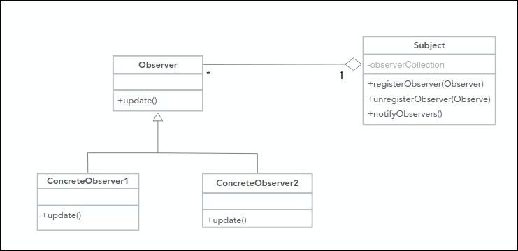
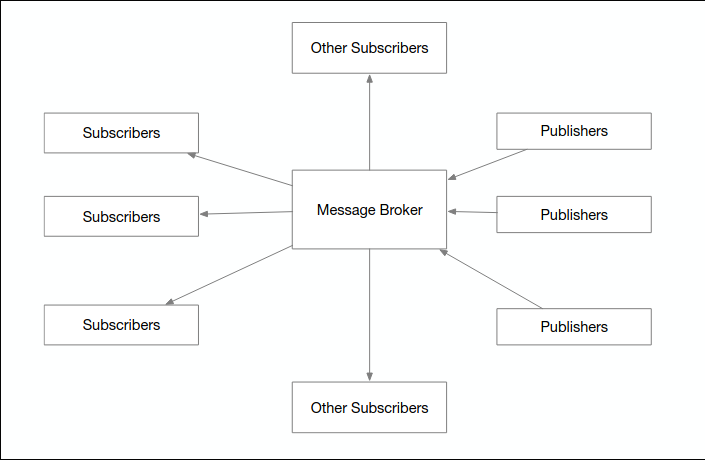
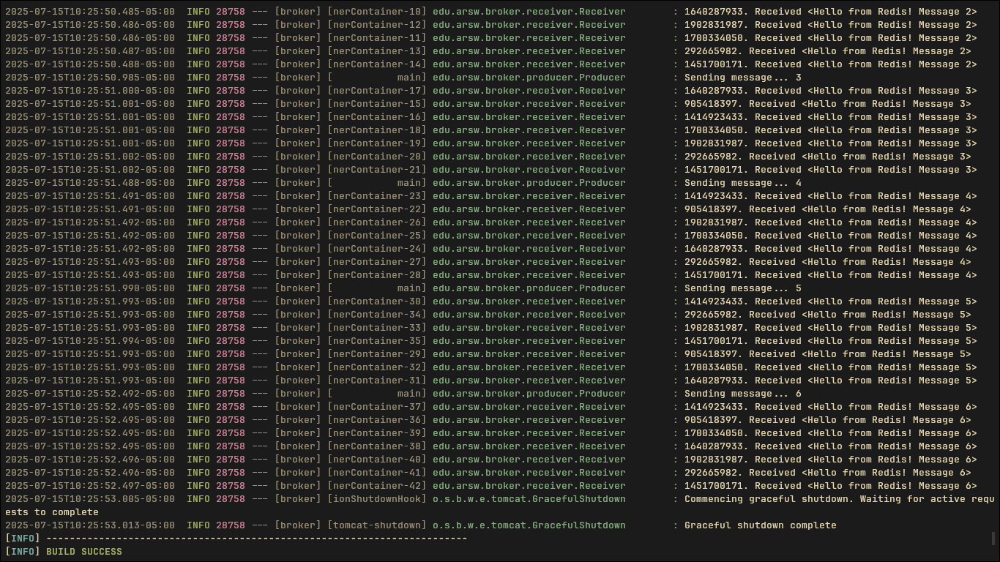

<div align="center">
    <h1 align="center">Message Broker with Redis</h1>
    <p align="center">
Implementation of a message broker using the Publish/Subscribe (Pub/Sub) pattern.
    </p>
</div>

</br>

## About this project

This project is an implementation of a message broker using the Publish/Subscribe (Pub/Sub) pattern. It is built with Java, Spring Boot, and uses Redis as the backend for message queue management.
The system follows a simple Pub/Sub messaging pattern with the following components:



- Producer: A CommandLineRunner that executes when the application starts. It publishes test messages to a Redis topic (pubsub:queue) at regular intervals.
- Consumer: A subscriber that listens to the pubsub:queue topic. Every time the producer sends a message, this consumer receives and processes it, displaying it in the console.
- Configuration: Contains the necessary Spring beans to configure the connection to Redis, the MessageListenerAdapter that binds the consumer, and the RedisMessageListenerContainer that manages the message listening process.
- Redis: Acts as the message broker, managing the delivery of messages from the producer to the topic subscribers.



</br>
</br>

## Technologies Used

- Java 21
- Spring Boot 3
- Spring Data Redis
- Maven
- Docker
- Redis

</br>
</br>

## Installation and Execution

Follow these steps to get the project up and running:

1. Clone the Repository

```sh
git clone https://github.com/Andr3xDev/ARSW-Broker.git
cd ARSW-Broker
```

2. Start the Redis Instance with Docker

Run the following command to start a Redis container. Port 45000 on your local machine will be mapped to port 6379 in the container, which is used by the Spring application.

```sh
docker run --name some-redis -p 45000:6379 -d redis
```

To verify that the container is running, use docker ps.

3. Run the Spring Boot Application

```sh
mvn spring-boot:run
```

Once started, you will see the Spring application logs in the console, followed shortly by the messages being sent by the Producer and received by the Consumer.

### Expected console output


